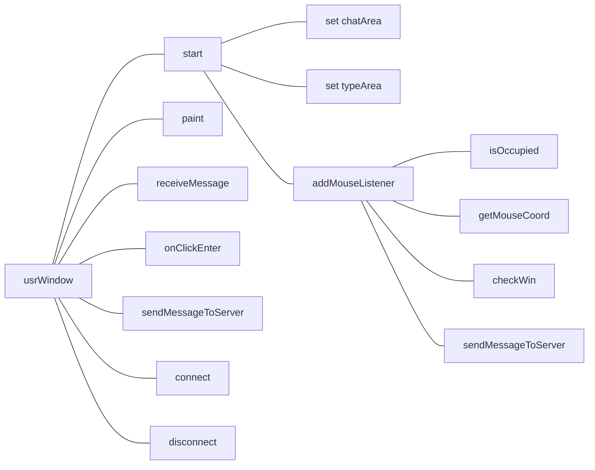

# 五子棋直播平台项目报告

周寒靖 3180104396

## 项目介绍

五子棋直播平台由一个服务端和多个客户端组成，是一个下五子棋、五子棋观战、畅谈想法的直播平台。主要功能如下：

- 0号和1号用户可进行五子棋对决
- 平台将棋局战况对所有用户直播
- 所有用户都可在聊天区发送信息，进行群聊

服务器监听端口为8000，最大支持用户数为100。


## 代码结构与功能

### 代码结构

1、服务端伪代码

服务端主要起管理用户、转发数据的作用。每创建一个客户端，服务端就创建一个新的进程来管理，并将新用户加入``users``列表中；每收到一个用户发的消息（包括群聊消息和落子信息），就群发给所有用户。

```java
//class Server:
create socket connection;
create List users;
while(true){
    accept a connection request;
    users.add(client);
    create new thread for new client;
}
//class Client:
while(true){
    in = socket.getInputStream();
	din = new DataInputStream(in);
    message = din.readUTF();
    forwardToAllClients();
}
```

2、用户端主体框架



3、数据包结构

| 数据包内容                                         | 数据包格式           |
| -------------------------------------------------- | -------------------- |
| 0号用户的落子信息                                  | \\\\0xxx，前缀2个\   |
| 1号用户的落子信息                                  | \\\\1xxx，前缀2个\   |
| x号用户已胜利的信息                                | \\\\2x，前缀2个\     |
| 用户首次登录时服务器为其分配的ID，xx表示ID号，0-99 | \\xx，前缀1个\       |
| 群发的信息                                         | \\\\\\xxxx，前缀1个\ |


### 代码功能

1、服务端

``void forwardToAllClients(String message)`` 

该方法遍历列表中所有``users``，将从某一用户收到的``message``转发给所有用户，达到群聊、直播下棋的效果。


``Client(Socket socket)`` 

该方法负责``Client``类的初始化工作，主要是建立socket收发数据的连接和为新登录的用户分配ID。当新接入一个用户时，若未超出容量，则为其分配一个ID号，并主动发送给他，包格式为``\xx``(``xx``为ID号)。因此易得ID的范围是0-99，本服务器最大用户容量为100个。


2、用户端

``background.addMouseListener()``

我们为``background``添加了鼠标监听事件，此处``background``就是棋盘所在的灰色区域。伪代码如下。

```java
background.addMouseListener(new MouseListener() {
	@Override
			public void mouseClicked(MouseEvent e) {
            	if(loseID!=-1) return;//already end
				if(ID!=0 && ID!=1 ) return;//not chess player
				if(lastTurn==ID) return;//last turn is myself
                get mouse coordinate and update chessPos;
                if(checkWin()==true) {//win
                    //update isWin and loseID
                    isWin=1;
                    loseID=1-ID;
                }
                repaint();//update chessboard
                generate chessInfo;
                sendMessageToServer(chessInfo.toString());//send to server
            }
}
```

此处解释一下变量``lastTurn``的作用，其为防止用户连续落子。当某用户落子后，``lastTurn``变成自身ID并发送给所有用户；若同一用户连续落子，``lastTurn``依旧不变。此时中判断``lastTurn``是否变化，若不变则判定某方用户连续落子，忽略收到的棋子信息。


``boolean checkWin()``

该方法负责判断棋局的输赢，在每一次落子后都得调用。按照五子棋规则，分别判断棋盘中每个棋子的同一行、同一列、同一对角线是否存在同色五子相连。若存在，则胜负已定，上一个落子的用户胜利；反之，则棋局继续。伪代码如下。

```java
int count=0;
for(each chessPos){
    for(there exists adjacent chess of same color in same row)//row
        count++;
    if(count==5) break;
    else count=0;
    for(there exists adjacent chess of same color in same column)//column
        count++;
    if(count==5) break;
    else count=0;
    for(there exists adjacent chess of same color in same diagonal)//diagonal
        count++;
    if(count==5) break;
    else count=0;
}
if(count==5) return true;
else return false;
```


``void paint(Graphics g)``

代码中多次调用``repaint()``方法，实则是再次调用``paint()``方法重绘图像。``paint()``负责绘制棋盘与棋子，当棋局结束时绘制胜利/失败的提示信息。判断胜利/失败时，若尚未分出胜负，存储失败者ID的``loseID``为-1，若分出胜负，则变成0或1。胜利者的``isWin==1``，失败者的``isWin==0``，观战者的``isWin==-1``。


``void ReceiveMessage::run()``

该方法维护一个死循环，负责解析收到的数据包。若收到的包以``\\\``开头，则包内容为群聊信息，将其显示在``chatContent``框中；若以``\\2x``开头，则报内容为x号用户胜利信息，调用``repaint()``显示棋局结果；若以``\\1``或``\\0``开头，则包内容为1号或0号用户落子情况，更新``chessPos[]``中的棋子位置信息，并``repaint()``棋局；若以``\xx``开头，则包内容为服务器为当前用户分配的ID。下图为解析数据包的部分代码。


``void sendMessageToServer(String message)``

该方法负责将当前用户产生的信息发送给服务端。


## 运行结果与分析

### 服务端显示

1、服务器显示已就位。若接入一个用户，则会提示并显示用户ID。


2、若同时开启多个服务器，则会报错“端口被占用”。


3、服务端每转发一个 群聊消息，会打印如下提示。


4、当用户端关闭后，则会打印如下提示。


### 初始界面

1、用户端的界面分区如下。


### 群聊功能

1、用户可在“聊天发送区”输入文字并按“Enter”键群发。

       

2、“群聊区”会显示发送方、发送时间和群聊内容。如下图中，user 0在21:02:44时间点群发了一个“今天风好大”，user 1在21:02:47时间点群发了“是的”。


3、群聊区对于中文、英文、符号都支持，当内容超过文本框时，用户上下拉动右边的进度条查看。


### 下棋功能

1、只有ID为0号和1号的用户能进行五子棋对决，其余用户只能观棋，不能下棋。0号用户为黑子，1号用户为白子。双方一次只能落一子，不可悔棋。在下棋同时，每个用户都可在群聊区交流。


### 棋局结束

1、当胜负已定时，双方界面如下图所示，此时群聊可继续，但棋盘不可再操作。若想重开一局，必须退出0和1号用户重新登录。


2、胜负已定，其他观战用户的界面显示如下图。


## 心得体会

1、本项目由于要用``paint()``通过像素位置画出棋盘，为了画出合适大小的棋盘，需要不断调整位置参数。更繁琐的是，要确定鼠标点击的位置，这需要将鼠标的点击位置坐标与棋盘坐标进行转换。其实调参难度并不高，但很耗时间。下面为经过无数次尝试调好的棋盘格线起点的参数。

```java
int beginX=winWidth/2-9*cell;//origin:(68,9)
int beginY=winHeight/8+30;
int endX=beginX+cell*18;
int endY=beginY+cell*18;
```

2、``repaint()``

每次落子后棋盘都得重绘，我曾尝试多次调用``paint()``来实现，但它的传入参数``Graphics g``不知道该填什么。经查阅得，``repaint()``是系统回调函数，不能被主动调用。后来老师课上写“画板”项目时，用到了``repaint()``。这个方法是一个具有刷新页面效果的方法，如果你要页面进行重画就可以调用。它通过调用线程，由线程去调用``update()``方法清除当前显示，并再调用``paint()``方法进行绘制下一个需要显示的内容。于是我改成多次调用``repaint()``解决了重绘问题。

